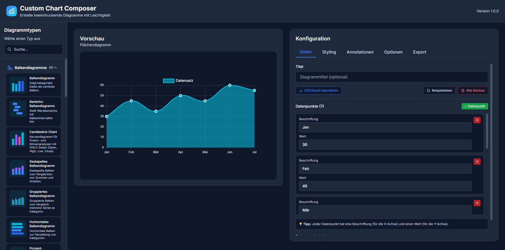
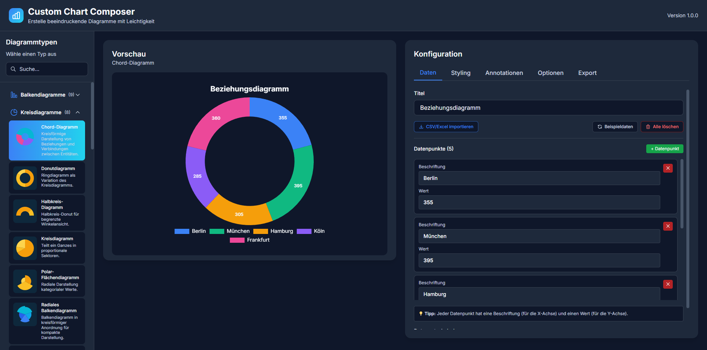
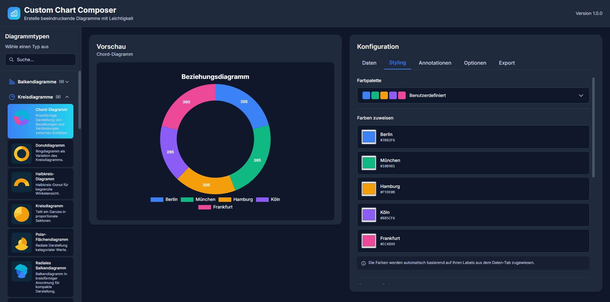
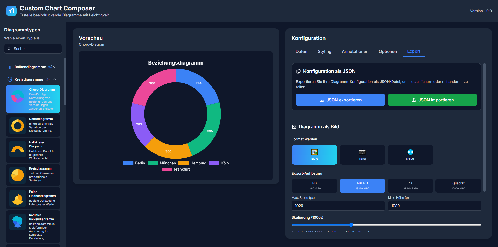
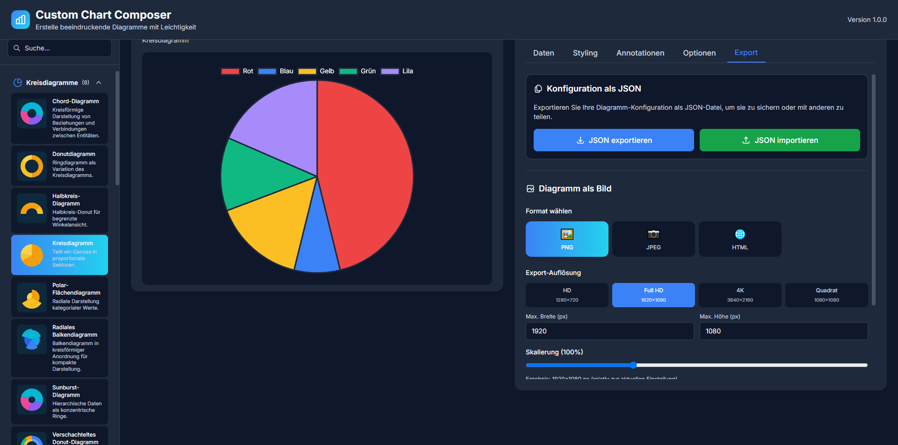
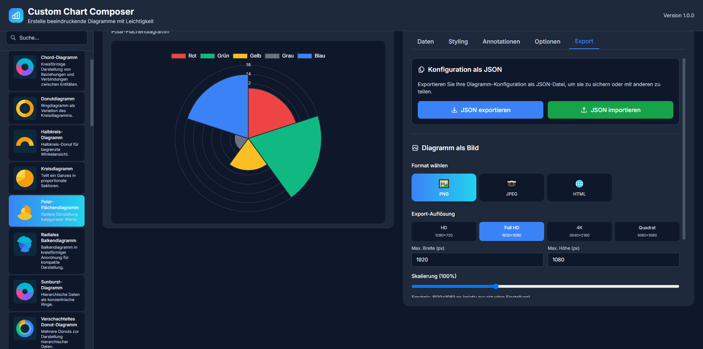
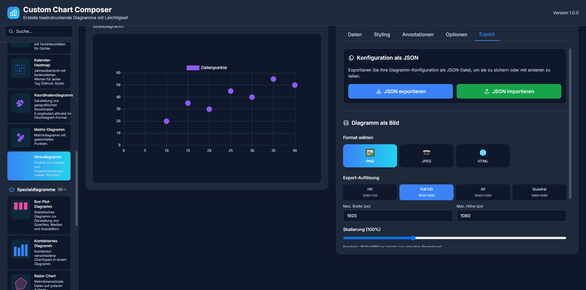
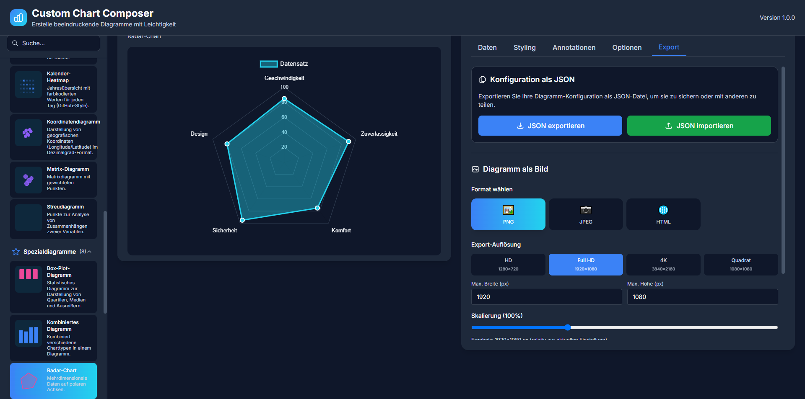
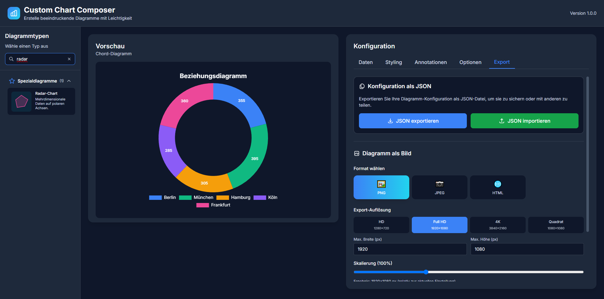

# Custom Chart Composer


Ein modernes, webbasiertes Tool zur einfachen Erstellung ästhetisch ansprechender Diagramme. Mit einer intuitiven Benutzeroberfläche können Sie verschiedene Diagrammtypen auswählen, Daten und Farben anpassen und das fertige Ergebnis in verschiedenen Formaten exportieren.


*Die Hauptansicht der Custom Chart Composer Anwendung mit Sidebar für Diagrammtypen, Vorschau-Bereich und Konfigurationspanel*

## ✨ Features

- 🎨 **40+ Diagrammtypen**: Balken, Horizontal, Linie, Fläche, Kreis, Donut, Radar, Streudiagramm, Blasen, Polar-Fläche, Gestapelt, Multi-Line, Kombiniert, Gruppiert, Treppenstufen, Vertikal, Prozent, Heatmap, Treemap, Sankey, Trichter, Violin, Box-Plot, Kalender-Heatmap, Koordinaten, Matrix, Sunburst, Wasserfall und viele mehr
- 🎯 **Modulares Plugin-System**: Neue Diagrammtypen einfach hinzufügen
- 🖌️ **Umfangreiche Anpassungen**: Farben, Beschriftungen, Optionen
- 📦 **Multiple Export-Formate**: PNG, JPEG, HTML
- 🌙 **Modernes Dark Theme**: Professionelles UI-Design
- 🐳 **Docker-Support**: Einfache Bereitstellung
- ⚡ **Live-Vorschau**: Echtzeit-Aktualisierung bei Änderungen

## 🏗️ Technologie-Stack

| Komponente | Technologie |
|------------|-------------|
| Frontend | React + Vite + TailwindCSS |
| Backend | Node.js + Express |
| Charts | Chart.js |
| Export | Canvas (Node) |
| Container | Docker |

## 📋 Voraussetzungen

- Node.js 20+ (für lokale Entwicklung)
- Docker & Docker Compose (für Container-Deployment)
- npm oder yarn

## 🚀 Schnellstart

### Option 1: Docker (Empfohlen)

```bash
# Repository klonen
git clone <repository-url>
cd Custom-Chart-Composer

# Mit Docker Compose starten
docker-compose up --build

# App öffnen unter http://localhost:3003
```

### Option 2: Lokale Entwicklung

#### Windows

```bash
# Doppelklick auf start-dev.bat
# oder im Terminal:
start-dev.bat
```

#### Linux/Mac

```bash
# Ausführbar machen
chmod +x start-dev.sh

# Starten
./start-dev.sh
```

#### Manuell

```bash
# Backend starten
cd backend
npm install
npm run dev

# In einem neuen Terminal: Frontend starten
cd frontend
npm install
npm run dev
```

**Frontend**: http://localhost:5173
**Backend API**: http://localhost:3003

## 🖥️ Electron Desktop (Windows)

Die Desktop-Variante nutzt denselben Express-Server und das gebaute Vite-Frontend wie die Docker- bzw. Web-Version. Alle Änderungen an Backend, Frontend oder den Modulen wirken sich somit automatisch auch auf die Electron-App aus. Der Docker-Workflow bleibt unverändert funktionsfähig.

### Vorbereitung

```bash
# Abhängigkeiten installieren
cd backend && npm install && cd ..
cd frontend && npm install && cd ..

# Electron-Hülle installieren
cd desktop/electron
npm install
```

### Windows-Build erstellen

```bash
cd desktop/electron
npm run build:win        # erzeugt frontend/dist und erstellt einen signierfreien NSIS-Installer in desktop/electron/dist
```

Der fertige Installer befindet sich im Verzeichnis `desktop/electron/dist`. Für andere Plattformen kann `npm run build` mit zusätzlichen Targets aus `electron-builder` verwendet werden.

### Entwicklung im Desktop-Kontext

```bash
# Frontend-Dev-Server starten
cd frontend
npm run dev

# In einem zweiten Terminal das Electron-Fenster öffnen (verwendet denselben Dev-Server)
cd ../desktop/electron
npm run dev
```

> **Hinweis:** Die Electron-App startet automatisch den Express-Server auf einem freien lokalen Port und übergibt diesen intern an das Frontend. Anpassungen am Backend (z. B. neue Module im Ordner `backend/modules`) stehen sowohl in Docker als auch in der Desktop-App direkt zur Verfügung.

## 📁 Projektstruktur

```
Custom-Chart-Composer/
├── backend/
│   ├── controllers/          # API-Controller
│   ├── routes/              # API-Routes
│   ├── services/            # Business Logic
│   ├── modules/             # Chart-Module (40+ Diagrammtypen)
│   │   ├── areaChart.js
│   │   ├── barChart.js
│   │   ├── boxPlotChart.js
│   │   ├── bubbleChart.js
│   │   ├── calendarHeatmap.js
│   │   ├── candlestickChart.js
│   │   ├── chordChart.js
│   │   ├── coordinateChart.js
│   │   ├── curvedAreaChart.js
│   │   ├── dashedLineChart.js
│   │   ├── donutChart.js
│   │   ├── funnelChart.js
│   │   ├── gaugeChart.js
│   │   ├── groupedBarChart.js
│   │   ├── heatmapChart.js
│   │   ├── horizontalBarChart.js
│   │   ├── lineChart.js
│   │   ├── matrixChart.js
│   │   ├── mixedChart.js
│   │   ├── multiLineChart.js
│   │   ├── nestedDonutChart.js
│   │   ├── percentageBarChart.js
│   │   ├── pieChart.js
│   │   ├── polarAreaChart.js
│   │   ├── radarChart.js
│   │   ├── radialBarChart.js
│   │   ├── rangeBarChart.js
│   │   ├── sankeyChart.js
│   │   ├── scatterChart.js
│   │   ├── segmentedBarChart.js
│   │   ├── semiCircleChart.js
│   │   ├── smoothLineChart.js
│   │   ├── stackedBarChart.js
│   │   ├── steppedLineChart.js
│   │   ├── streamGraph.js
│   │   ├── sunburstChart.js
│   │   ├── treemapChart.js
│   │   ├── verticalLineChart.js
│   │   ├── violinChart.js
│   │   └── waterfallChart.js
│   ├── package.json
│   └── server.js
│
├── frontend/
│   ├── src/
│   │   ├── components/      # React-Komponenten
│   │   │   ├── Layout/
│   │   │   ├── ChartPreview.jsx
│   │   │   ├── ChartConfigPanel.jsx
│   │   │   └── ExportPanel.jsx
│   │   ├── hooks/           # Custom React Hooks
│   │   ├── services/        # API-Services
│   │   ├── App.jsx
│   │   └── main.jsx
│   ├── package.json
│   └── vite.config.js
│
├── docker-compose.yml
├── Dockerfile
├── screenshots/            # Screenshots der Anwendung
│   ├── README.md          # Detaillierte Screenshot-Beschreibungen
│   └── *.png              # Screenshots verschiedener Diagrammtypen
├── Guideline.md            # Technische Spezifikation
└── README.md
```

## 🎯 Verwendung

### 1. Diagrammtyp auswählen


*Auswahl verschiedener Diagrammtypen mit Live-Vorschau*

Wählen Sie in der Sidebar den gewünschten Diagrammtyp:

**Balkendiagramme (9 Typen):**
- **Balkendiagramm**: Klassische Wertevergleiche
- **Horizontales Balkendiagramm**: Balken von links nach rechts
- **Gestapeltes Balkendiagramm**: Mehrere Datensätze übereinander
- **Gruppiertes Balkendiagramm**: Mehrere Datensätze nebeneinander
- **Prozent-Balkendiagramm**: Prozentuale Verteilung
- **Radiales Balkendiagramm**: Kreisförmige Anordnung
- **Range-Balkendiagramm**: Bereichswerte darstellen
- **Segmentiertes Balkendiagramm**: Aufgeteilte Balken
- **Wasserfall-Diagramm**: Kumulative Änderungen

**Liniendiagramme (9 Typen):**
- **Liniendiagramm**: Trends und Zeitreihen
- **Flächendiagramm**: Gefüllte Linie für Volumen
- **Multi-Liniendiagramm**: Mehrere Linien vergleichen
- **Treppenstufen-Liniendiagramm**: Gestufte Verläufe
- **Vertikales Liniendiagramm**: Spezielle Darstellung
- **Geglättetes Liniendiagramm**: Weiche Kurven
- **Gestricheltes Liniendiagramm**: Gestrichelte Linien
- **Geschwungenes Flächendiagramm**: Weich gefüllte Kurven
- **Stream-Graph**: Gestapeltes Flächendiagramm

**Kreisdiagramme (8 Typen):**
- **Kreisdiagramm**: Anteile und Verhältnisse
- **Donutdiagramm**: Modern mit Loch in der Mitte
- **Polar-Flächendiagramm**: Kreisförmige Flächendarstellung
- **Halbkreis-Diagramm**: Halbkreis-Donut
- **Radiales Balkendiagramm**: Kreisförmige Balken
- **Sunburst-Diagramm**: Hierarchische konzentrische Ringe
- **Verschachteltes Donut**: Mehrere Donuts
- **Chord-Diagramm**: Beziehungen zwischen Entitäten

**Punktdiagramme (6 Typen):**
- **Streudiagramm**: Korrelationen zwischen zwei Variablen
- **Blasendiagramm**: 3-dimensionale Daten mit Radius
- **Heatmap-Diagramm**: Matrix mit Farbintensitäten
- **Kalender-Heatmap**: GitHub-Style Jahresübersicht
- **Koordinatendiagramm**: Geografische Koordinaten
- **Matrix-Diagramm**: Gewichtete Punkte

**Spezialdiagramme (8 Typen):**
- **Radar-Chart**: Mehrdimensionale Daten auf polaren Achsen
- **Box-Plot-Diagramm**: Statistische Verteilungen
- **Kombiniertes Diagramm**: Verschiedene Charttypen kombiniert
- **Sankey-Diagramm**: Flussdiagramm für Datenflüsse
- **Tachometer-Diagramm**: Aktuelle Werte visualisieren
- **Treemap-Diagramm**: Hierarchische verschachtelte Rechtecke
- **Trichter-Diagramm**: Prozessphasen darstellen
- **Violin-Chart**: Erweiterte statistische Verteilungen

### 2. Daten konfigurieren

Im Tab **"Daten"**:
- Titel eingeben (optional)
- Beschriftungen (Labels) kommagetrennt eingeben
- Werte kommagetrennt eingeben
- Datensatz-Label definieren

### 3. Styling anpassen


*Umfangreiche Styling-Optionen mit Farbpalette, Hintergrundfarbe und Hintergrundbild-Upload*

Im Tab **"Styling"**:
- **Farbpalette**: Benutzerdefinierte Farbzuweisung für jeden Datenpunkt
- **Hintergrundfarbe**: Vordefinierte Optionen oder eigene Farbauswahl
- **Hintergrundbild**: Upload-Funktion für PNG, JPG, GIF bis 5MB
- **Transparente Hintergründe**: Für Overlay-Darstellungen

### 4. Optionen einstellen

Im Tab **"Optionen"**:
- Legende ein/ausschalten
- Gitter anzeigen/verbergen
- Diagrammspezifische Optionen anpassen
- Exportgröße festlegen (Breite/Höhe)

### 5. Exportieren


*Umfangreiche Export-Funktionen mit verschiedenen Formaten und Auflösungen*

**Export-Formate:**
- **PNG**: Hochqualitative Rasterbilder
- **JPEG**: Komprimierte Bilder für Web
- **HTML**: Interaktive Diagramme für Webseiten

**Auflösungen:**
- **HD**: 1280×720 Pixel
- **Full HD**: 1920×1080 Pixel  
- **4K**: 3840×2160 Pixel
- **Quadrat**: 1080×1080 Pixel
- **Benutzerdefiniert**: Eigene Dimensionen

**Zusätzliche Optionen:**
- **Skalierung**: Prozentuale Größenanpassung
- **Transparenter Hintergrund**: Für Overlay-Darstellungen
- **JSON-Export**: Konfiguration speichern und teilen

## 📊 Diagrammtypen im Detail

Die Custom Chart Composer bietet eine beeindruckende Vielfalt an Diagrammtypen für alle Datenvisualisierungs-Anforderungen:

### Kreisdiagramme

*Klassisches Kreisdiagramm mit proportionalen Sektoren*

### Polar-Diagramme  

*Radiale Darstellung kategorialer Werte*

### Punktdiagramme

*Streudiagramm für Korrelationsanalyse zwischen zwei Variablen*

### Spezialdiagramme

*Radar-Chart für mehrdimensionale Daten auf polaren Achsen*

### Suchfunktion

*Intelligente Suchfunktion zur schnellen Navigation durch alle Diagrammtypen*

> **📸 Screenshots**: Eine detaillierte Sammlung aller Screenshots mit Beschreibungen finden Sie im Ordner [`screenshots/`](screenshots/README.md)

| Methode | Route | Beschreibung |
|---------|-------|--------------|
| GET | `/api/charts` | Liste aller verfügbaren Diagrammtypen |
| POST | `/api/render` | Rendert ein Diagramm |
| POST | `/api/export` | Exportiert Diagramm in gewähltem Format |
| GET | `/api/plugins/reload` | Lädt Chart-Module neu |
| GET | `/health` | Health-Check |

### Beispiel: Export Request

```javascript
POST /api/export
Content-Type: application/json

{
  "chartType": "bar",
  "config": {
    "labels": ["Jan", "Feb", "Mär"],
    "values": [10, 20, 30],
    "colors": ["#4ADE80", "#22D3EE", "#F472B6"],
    "backgroundColor": "#0F172A",
    "width": 800,
    "height": 600
  },
  "format": "png",
  "transparent": false
}
```

## 🔧 Eigene Chart-Module erstellen

Neue Diagrammtypen können durch Hinzufügen eines Moduls in `backend/modules/` erstellt werden:

```javascript
// backend/modules/customChart.js
import Chart from 'chart.js/auto';

export default {
  id: "custom",
  name: "Mein Custom Chart",
  library: "chartjs",
  configSchema: {
    labels: { type: "array", default: ["A", "B", "C"] },
    values: { type: "array", default: [10, 20, 30] },
    colors: { type: "array", default: ["#FF0000", "#00FF00", "#0000FF"] },
    backgroundColor: { type: "string", default: "#0F172A" },
    width: { type: "number", default: 800 },
    height: { type: "number", default: 600 },
    options: {
      showLegend: { type: "boolean", default: true }
    }
  },
  render: async (ctx, config, canvas) => {
    // Chart.js Rendering-Logik
    const chartConfig = {
      type: 'bar', // oder 'line', 'pie', etc.
      data: { /* ... */ },
      options: { /* ... */ }
    };
    new Chart(ctx, chartConfig);
  }
};
```

Nach dem Hinzufügen wird das Modul automatisch geladen und in der UI verfügbar sein.

## 🎨 Design-System

### Farbpalette

| Element | Farbe | Hex |
|---------|-------|-----|
| Hintergrund | Dunkel | #0F172A |
| Sekundärfläche | Dunkelgrau | #1E293B |
| Akzentfarbe 1 | Blau | #3B82F6 |
| Akzentfarbe 2 | Cyan | #22D3EE |
| Text Hell | Weiß | #F8FAFC |
| Text Grau | Hellgrau | #CBD5E1 |

### Typografie

- **Schriftart**: Inter (Google Fonts)
- **Überschriften**: 600 Gewicht, 1.5-2rem
- **Fließtext**: 400 Gewicht, 0.875-1rem

## 🐳 Docker-Deployment

### Development

```bash
docker-compose up
```

### Production

```bash
docker-compose up -d --build
```

### Logs anzeigen

```bash
docker-compose logs -f
```

### Container stoppen

```bash
docker-compose down
```

## 🛠️ Entwicklung

### Backend Development

```bash
cd backend
npm install
npm run dev  # mit Nodemon (Hot-Reload)
```

### Frontend Development

```bash
cd frontend
npm install
npm run dev  # Vite Dev Server
```

### Build für Production

```bash
# Frontend
cd frontend
npm run build

# Backend (keine Build erforderlich)
cd backend
npm install --production
```

## 📝 Umgebungsvariablen

### Backend (.env)

```env
PORT=3003
NODE_ENV=development
```

### Frontend (.env)

```env
VITE_API_URL=http://localhost:3003/api
```

## 🧪 Testing

```bash
# Backend Tests (wenn implementiert)
cd backend
npm test

# Frontend Tests (wenn implementiert)
cd frontend
npm test
```

## 🤝 Mitwirken

Beiträge sind willkommen! Bitte:

1. Forken Sie das Repository
2. Erstellen Sie einen Feature-Branch (`git checkout -b feature/AmazingFeature`)
3. Committen Sie Ihre Änderungen (`git commit -m 'Add some AmazingFeature'`)
4. Pushen Sie zum Branch (`git push origin feature/AmazingFeature`)
5. Öffnen Sie einen Pull Request

## 📄 Lizenz

Dieses Projekt ist unter der MIT-Lizenz lizenziert - siehe [LICENSE](LICENSE) Datei für Details.

## 🙏 Danksagungen

- [Chart.js](https://www.chartjs.org/) - Für die fantastische Chart-Library
- [React](https://react.dev/) - Für das UI-Framework
- [TailwindCSS](https://tailwindcss.com/) - Für das Styling-Framework
- [Vite](https://vitejs.dev/) - Für das Build-Tool

## 📞 Support

Bei Fragen oder Problemen:
- GitHub Issues öffnen
- Dokumentation in `Guideline.md` lesen

---

**Erstellt mit ❤️ für schöne Diagramme**
